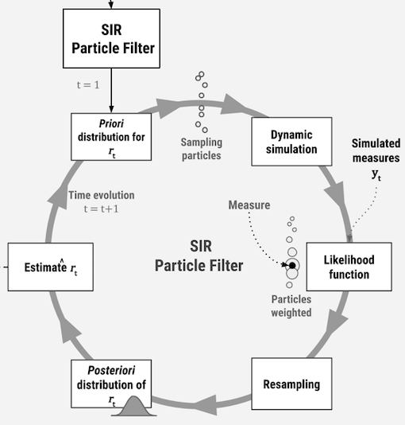

% Introduction

 
This website provides a more detailed documentation of the R scripts that accompanies a manuscript prepared by Kaique dos S. Alves under the supervision of Prof. Emerson Del Ponte, during his MSc studies at the Universidade Federal de Vicosa, MG, Brazil.

In this work, one variation of the Particle Filter, also known as Sequential Monte Carlo, was evaluated as alternative to estimate the time-varying apparent infection rate (sensu Vanderplank, 1962) during the course of plant disease epidemics. Our application is a solution for a typical inverse problem, or when the parameters are estimated from the measures, as opposed to the direct problem where measures are estimated from the parameters.

Given that the apparent infection rate _r_(sub)y(/sub) parameter is unknown/unmeasured during actual epidemics, synthetic epidemics needed to be produced and we chose the logistic model that represents the progress of a polycyclic epidemics. These were produced under various scenarios of simulated patterns _r_(sub)y(/sub) (random, increasing, decreasing, oscillating, etc.) and two levels of noise (uncertainty) in disease intensity at each time point. We compared our results with a reference method for obtaining the rate between two time points, which is a rearrangement of the logistic model proposed initially by Vanderplank (1962). We tested the method using different (incremental) interval between two time points. A [preprint version of the manuscript](https://www.biorxiv.org/content/10.1101/625822v1) was published in BioRxiv.

## Citation 

The research compendium with all files for reproducing the work and generating the figures, as well as this website, are available as an OSF project and can be cited as follows:

Alves, K. S., & Del Ponte, E. M. (2019, May 2). Research compendium - Estimation of a time-varying apparent infection rate from plant disease progress curves: a particle filter approach. https://doi.org/10.17605/OSF.IO/7NYUJ  

